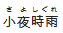

### furigana-markdown

HTML5 `<ruby>` markdown notation for [Discourse](https://www.discourse.org).

As of now the markdown-it version does not support all features and will not work on the server-side.
Once it can be properly loaded into the server side this readme will be dedicated to the markdown-it version.

## Usage

[//]: # (Images are used instead of HTML ruby tags to preserve compatibility with more markdown implementations.)

#### Basic Furigana
By default, the following formats can be used.
```
[世界]^(せかい)
[世界]{せかい}
```
produces


#### Inline/Auto-matching Furigana
By default, inline matching can also be used. It only works above kanji however.
```
世界【せかい】
世界{せかい}
```
produces


#### Seperate Furigana for each Kanji
By default, furigana is displayed equally spaced above each kanji. Using any of the seperators `. ． 。 ・`, spacing can be specified (only in the inline format).
```
小夜時雨【さ・よ・しぐれ】
```
produces



#### Pattern Matching Furigana
Pattern matching, enabled by default, also allows the following formats,
in which the whole word can be added in kana to the furigana.
```
食べる【たべる】
食べる{たべる}
```
produces


By using the basic furigana format, compound words can be matched too.
```
[取り返す]{とりかえす}
```
produces


This makes it easier to get the kanji version of the word from an IME without backtracking through the text to place furigana.

## Custom Formats

By changing the `furigana plugin forms` setting, you can allow multiple
furigana markdown types.

* Each type is seperated by a `|`.
Each component of the type is seperated by a `:`.
* Please do not use `|` or `:` except as seperators in the configuration.
* If you do not want a seperator, leave it out. However, both sets of brackets are required.

For example:
```
[]:^:()|[]::{}
```
Will allow either `[main]^(annotation)` or `[main]{annotation}` to be used.

In the Discourse settings page, there are other settings for toggling each feature.

## Installation

Follow the [Install a Plugin](https://meta.discourse.org/t/install-a-plugin/19157) howto.

## Browser Support
Has been tested in the following as of 2017-7-8
* Firefox
* Chrome
* IE 11
* Opera

`<ruby>` is available and works in all modern browsers (and IE) except Opera Mini according to [Can I Use?](http://caniuse.com/#feat=ruby). If the `ruby` tag is properly stripped, the text will appear with furigana in configurable brackets (`【】` by default).

## License

MIT
